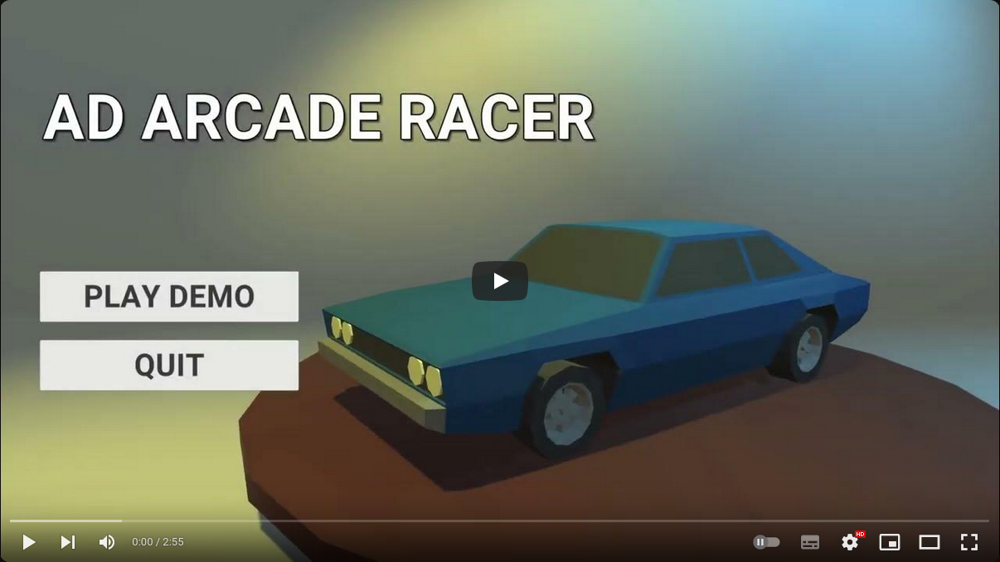

# ad-arcade-racer

This repository contains all the behavioral scripts I wrote for a game demo made with the Unity game engine;

I developed this demo for a university assignment (Game Development course).

## Watch the demo in action

## Coming soon

I will release the playable demo for Windows and Linux soon.

